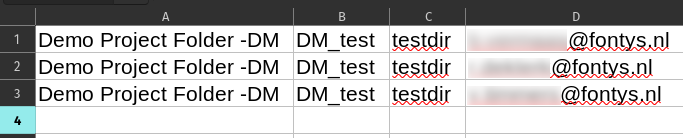
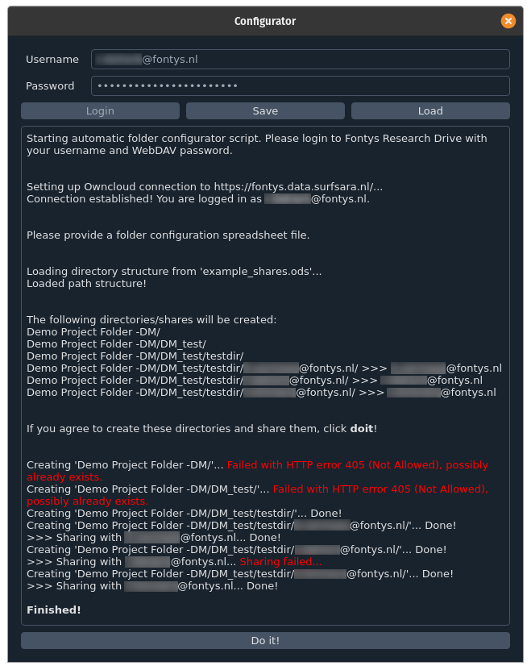
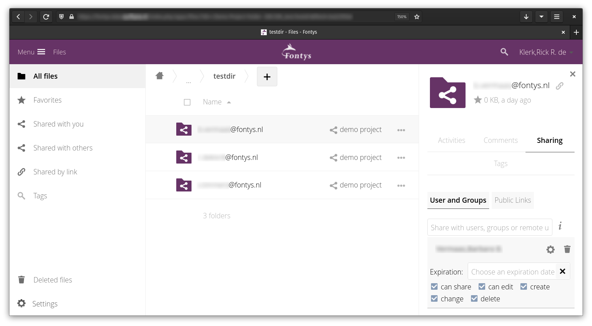

# Folder configurator

Graphical user interface to automatically make and share folders in bulk on Research Drive (Owncloud). We made this so 
we could automatically generate folders and shares for students at the start of each semester, as doing this by hand 
takes an inordinate amount of time.

## Installation

The software was made with 3.9x. The requirements can be installed with:

```shell
pip install -r requirements.txt
```

To build the executable you also need pyinstaller:

```shell
pip install pyinstaller
```

If you just want to use the software you can grab the executable from GitHub.

## Usage

Step 1: create folder structure you would like to have in spreadsheet software



Step 2: use the folder configurator



Step 3: profit?



In this example the first two folders already exist, so they cannot be generated. The share that fails is to the
owner of the folder, so that also fails.
